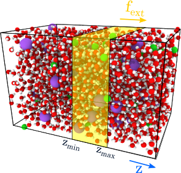
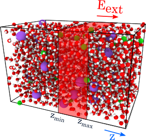

# Welcome to an **un**official version of GROMACS!
This version of Gromacs was forked from the release `release-2021` branch.

## Apply an external force on a slice of the simulation box



It is now possible to apply a force  on a slice  of the simulation box. This is equivalent to applying a pressure difference  on both sides of the slice  where  is the slice cross-section.  
The force is distributed between the atoms belonging to  such that for atom ,  
   

The syntax for adding an external force to a slice  of the simulation box is similar to that used for adding an external electric field:

 ```
 extforce-field-z = f omega t0 sigma zmin zmax 
 ```
 Where:
 - `f` is the amplitude of the force (kJ/mol/nm).
 - `t0` is the frequency (1/ps) for an oscillating field.
 -  `omega` is the central time point (ps) for pulse.
 -  `sigma` is the width of pulse (ps, if zero there is no pulse).
 -  `zmin` is the lowest value of z coordinate (nm) for which the field is applied.
 -  `zmax` is the highest value of z coordinate (nm) for which the field is applied (if `zmin` is equal to `zmax`, the force field is applied in whole simulation box).

If you assign atoms to the atom group `USER1` then the external forcefield is applied to the atoms belonging to this group.
If you assign atoms to the atom group `USER2` then an inverted external forcefield is applied to the atoms belonging to this group.

## Apply an external electric field on a slice of the simulation box



You can now apply an external electric field in a slice of the simulation box.  
The syntax of the e-field-(xyz) parameters has been changed as follows:
 ```
 e-field-z = E0 omega t0 sigma zmin zmax 
 ```
 Where:
 - `E0` is the amplitude of electric field (V/nm).
 - `t0` is the frequency (1/ps) for an oscillating field.
 -  `omega` is the central time point (ps) for pulse.
 -  `sigma` is the width of pulse (ps, if zero there is no pulse).
 -  `zmin` is the lowest value of z coordinate (nm) for which the field is applied.
 -  `zmax` is the highest value of z coordinate (nm) for which the field is applied (if `zmin` is equal to `zmax`, the force field is applied in whole simulation box).

## Some examples
1. Apply a external force on the slice of the simulation box defined as . The force is distributed to all the atoms belonging to this region.
```
extforce-field-z = 700 0 0 0 -1.5 2.5 
```

2. Apply a external force on the slice of the simulation box defined as . The force  is distributed on all atoms belonging to the group "Ion".
```
extforce-field-z = 700 0 0 0 -1.5 2.5
user1-grps       = Ion
```

3. Apply a external force on the slice of the simulation box defined as . The force  is distributed on all atoms belonging to the group "Ion". Moreover, a force  is distributed on all atoms belonging to the group "Sol".
```
extforce-field-z = 700 0 0 0 -1.5 2.5
user1-grps       = Ion
user2-grps       = Sol
```

4. Apply a -0.1V/nm external electric field along z for  : 
```
e-field-z = -0.1 0 0 0 1.5 2.5 
```

## Release configuration
```bash
mkdir build
cd build
cmake .. -DCMAKE_BUILD_TYPE=Release\
         -DGMX_BUILD_OWN_FFTW=ON\
         -DREGRESSIONTEST_DOWNLOAD=ON\
         -DGMX_GPU=CUDA -DCUDA_TOOLKIT_ROOT_DIR=/usr/local/cuda-11.5
cmake --build . -j 24
```

## Debugging configuration
```bash
mkdir build
cd build
cmake .. -DGMX_BUILD_OWN_FFTW=ON\
         -DREGRESSIONTEST_DOWNLOAD=ON\
         -DCMAKE_BUILD_TYPE=Debug
cmake --build . -j 24
```


---
# Original README
               Welcome to the official version of GROMACS!

If you are familiar with Unix, it should be fairly trivial to compile and
install GROMACS. GROMACS uses only the CMake build sytem, and our
installation guide can be found at
http://manual.gromacs.org/documentation/current/install-guide/index.html

Of course we will do our utmost to help you with any problems, but PLEASE 
READ THE INSTALLATION INSTRUCTIONS BEFORE CONTACTING US!

There are also several other online resources available from the homepage, 
and special information for developers.

If you are a developer, or change the source for any other reason, check
out http://www.gromacs.org/Developer_Zone.

                               * * * * *

GROMACS is free software, distributed under the GNU Lesser General
Public License, version 2.1 However, scientific software is a little
special compared to most other programs. Both you, we, and all other
GROMACS users depend on the quality of the code, and when we find bugs
(every piece of software has them) it is crucial that we can correct
it and say that it was fixed in version X of the file or package
release. For the same reason, it is important that you can reproduce
other people's result from a certain GROMACS version.

The easiest way to avoid this kind of problems is to get your modifications
included in the main distribution. We'll be happy to consider any decent 
code. If it's a separate program it can probably be included in the contrib 
directory straight away (not supported by us), but for major changes in the 
main code we appreciate if you first test that it works with (and without) 
MPI, threads, double precision, etc.

If you still want to distribute a modified version or use part of GROMACS
in your own program, remember that the entire project must be licensed
according to the requirements of the LGPL v2.1 license under which you
received this copy of GROMACS. We request that it must clearly be labeled as
derived work. It should not use the name "official GROMACS", and make
sure support questions are directed to you instead of the GROMACS developers.
Sorry for the hard wording, but it is meant to protect YOUR reseach results!

---

The development of GROMACS is mainly funded by academic research grants. 
To help us fund development, we humbly ask that you cite the GROMACS papers:

* GROMACS: A message-passing parallel molecular dynamics implementation
  H.J.C. Berendsen, D. van der Spoel and R. van Drunen
  Comp. Phys. Comm. 91, 43-56 (1995)
  DOI: https://doi.org/10.1016/0010-4655(95)00042-E
 
* GROMACS 4: Algorithms for highly efficient, load-balanced, and scalable
  molecular simulation
  B. Hess and C. Kutzner and D. van der Spoel and E. Lindahl
  J. Chem. Theory Comput. 4 (2008) pp. 435-447
  DOI: https://doi.org/10.1021/ct700301q

* GROMACS 4.5: a high-throughput and highly parallel open source
  molecular simulation toolkit
  Sander Pronk, Szilárd Páll, Roland Schulz, Per Larsson, Pär Bjelkmar,
  Rossen Apostolov, Michael R. Shirts, Jeremy C. Smith, Peter M. Kasson,
  David van der Spoel, Berk Hess, Erik Lindahl.
  Bioinformatics 29 (2013) pp. 845-54
  DOI: https://doi.org/10.1093/bioinformatics/btt055

* Tackling Exascale Software Challenges in Molecular Dynamics Simulations
  with GROMACS
  Szilárd Páll, Mark J. Abraham, Carsten Kutzner, Berk Hess, Erik Lindahl
  In S. Markidis & E. Laure (Eds.), Solving Software Challenges for Exascale,
  Lecture Notes for Computer Science, 8759 (2015) pp. 3–27
  DOI: https://doi.org/10.1007/978-3-319-15976-8_1

* GROMACS: High performance molecular simulations through multi-level parallelism from laptops to supercomputers
  M. J. Abraham, T. Murtola, R. Schulz, S. Páll, J. C. Smith, B. Hess, E. Lindahl,
  SoftwareX, 1, (2015), 19-25
  DOI: https://doi.org/10.1016/j.softx.2015.06.001

There are a lot of cool features we'd like to include in future versions,
but our resources are limited. All kinds of donations are welcome, both in 
form of code, hardware and funding! Industrial users who choose to pay
for a license pro bono (it is still LGPL and can be redistributed freely) or
contribute in other ways are listed as GROMACS supporters on our webpages. 
Don't hesitate to contact us if you are interested.


                       Good luck with your simulations!

                              The GROMACS Crew
